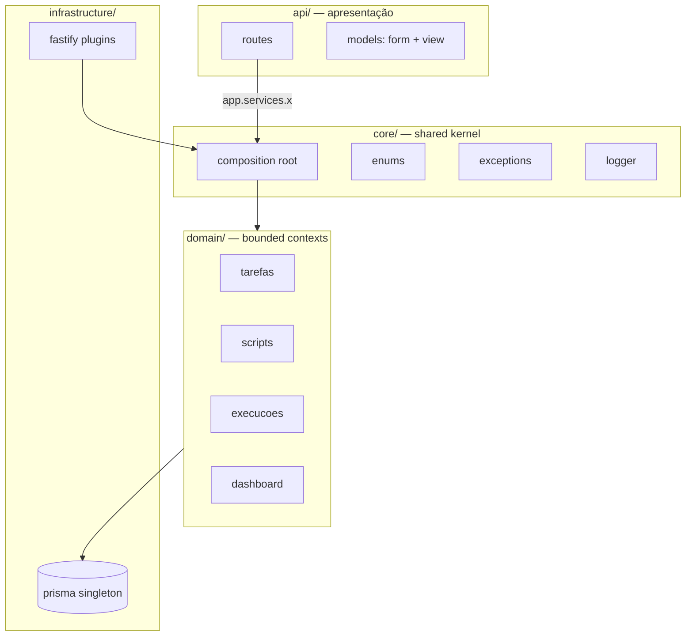

[](https://fastify.dev)
[](https://ejs.co)
[](https://htmx.org)
[](https://prisma.io)
[](https://www.typescriptlang.org)
[](https://nodejs.org)
[](https://sqlite.org)
[](LICENSE)

# Fatia Rápida v2

> Plataforma de automação de tarefas agendadas para Raspberry Pi — Fastify + HTMX + EJS + Prisma, com arquitetura DDD e **zero framework de SPA**.

Plataforma para criar, agendar e monitorar tarefas que executam scripts (Shell/Node/Python) ou comandos shell, com notificação opcional via Discord webhook. Construída para rodar em hardware limitado, com persistência local em SQLite e renderização server-side.

---

## Por que existe

Um Raspberry Pi headless precisava de automação com uma interface web acessível e notificações no Discord — sem a complexidade de um SPA, Kubernetes ou serviços externos. O resultado é uma ferramenta que "só funciona", no hardware que você tem, fazendo exatamente o que precisa.

---

## Stack

| Camada | Tecnologia | Por quê |
|--------|-----------|---------|
| HTTP Server | [Fastify v5](https://fastify.dev) | Leve, rápido, plugin-first |
| Templates | [EJS](https://ejs.co) + `@fastify/view` | Renderização server-side, sem bundle JS |
| Interatividade | [HTMX v2](https://htmx.org) | Swap parcial de HTML, sem framework frontend |
| Estilos | DaisyUI v4 + Tailwind (CDN) | Componentes prontos, sem build step |
| Banco | SQLite via [Prisma v5](https://prisma.io) | Arquivo local, zero infra |
| Agendamento | [node-cron v3](https://github.com/node-cron/node-cron) | Expressões cron nativas |
| Editor | [Monaco 0.52](https://microsoft.github.io/monaco-editor/) (CDN) | VS Code no browser |
| Validação | [Zod v3](https://zod.dev) | Schema type-safe |
| Auth | Sessões SQLite + cookie HMAC-SHA256 | Sem JWT, sem Redis |
| Notificações | Discord Webhook via Axios | Opcional por tarefa |
| Linguagem | TypeScript 5 + `tsx` | Sem compile em dev |

---

## Arquitetura de relance



4 camadas DDD: **`api/`** (transporte HTMX), **`core/`** (shared kernel + composition root), **`domain/`** (bounded contexts com service classes + padrões de projeto), **`infrastructure/`** (Prisma + plugins Fastify). O **composition root** é o único ponto que instancia e wired o grafo de dependências — `app.services` é type-safe em toda a app.

→ Detalhe em [docs/ARCHITECTURE.md](docs/ARCHITECTURE.md) · padrões em [docs/PATTERNS.md](docs/PATTERNS.md)

---

## Quickstart

```bash
git clone <repo> && cd Fatia-Rapida-Automation
npm install
cp .env.example .env          # preencha DATABASE_URL, SESSION_SECRET, ADMIN_PASSWORD_HASH
npx prisma migrate dev        # cria o banco
npm run hash-password         # gera o bcrypt hash pra ADMIN_PASSWORD_HASH
npm run dev                   # http://localhost:3000
```

Comandos úteis:

```bash
npm run dev          # dev (tsx watch)
npm run build        # produção (tsc + copy assets)
npm start            # roda o build
npx prisma studio    # editor visual do banco
npm run lint         # ESLint
npx tsc --noEmit     # typecheck
```

---

## Estrutura do projeto

```
src/
├── server.ts                         # entry + graceful shutdown
├── app.ts                            # bootstrap Fastify (plugins + routes + error handler)
├── config.ts                         # env vars (required/optional)
├── api/                              # APRESENTAÇÃO
│   ├── routes/                       #   6 route modules (auth, dashboard, tarefa, script, execucao, about)
│   └── models/                       #   form inputs (Zod) + view models de saída
├── core/                             # SHARED KERNEL
│   ├── composition/composition-root  #   buildServices() — wiring único
│   ├── enums/                        #   ScriptTipo, ExecucaoStatus, ActionTipo (const tipados)
│   ├── exceptions/                   #   BusinessException + global error handler
│   └── logger/                       #   Logger interface + FastifyLogger
├── domain/                           # BOUNDED CONTEXTS
│   ├── dashboard/service/            #   DashboardService
│   ├── execucoes/
│   │   ├── action/                   #   Strategy: ActionExecutor + Script/Shell/Noop + Factory
│   │   ├── model/                    #   ExecucaoSaida (discriminated union)
│   │   ├── notification/             #   NotificationChannel + Discord + Service
│   │   ├── runner/process-runner     #   spawn wrapper único
│   │   └── service/execucao-service  #   orquestrador
│   ├── scripts/{service, storage}    #   ScriptService + ScriptStorage (cache self-healing)
│   └── tarefas/{scheduling, service} #   SchedulerManager + cron helpers + TarefaService
├── infrastructure/                   # DETALHES TÉCNICOS
│   ├── fastify/                      #   plugins: prisma, auth, services, scheduler
│   └── persistence/prisma            #   PrismaClient singleton
└── views/                            # EJS (layouts, pages, partials)
```

---

## Conceitos chave

- **Tarefa** — unidade de automação: nome, dias + horários (cron), ação (script OU comando shell OU noop), webhook Discord opcional.
- **Script** — arquivo executável (Shell/Node/Python) gerenciado pela UI. Conteúdo espelhado no banco (`conteudo`); arquivo em disco é cache self-healing.
- **Execução** — log de cada run: status (SUCESSO/FALHA/EM_ANDAMENTO), stdout/stderr, duração, `saida` tipada.
- **Scheduler** — `SchedulerManager` agenda 1 cron job por (tarefa × horário), re-busca a tarefa no DB na execução (sem snapshot stale).

---

## Documentação

| Doc | O que cobre |
|-----|-------------|
| [Architecture](docs/ARCHITECTURE.md) | DDD layering, composition root, bounded contexts |
| [Patterns](docs/PATTERNS.md) | Strategy/Factory/Observer/Template — problema→padrão→sketch |
| [Execution flow](docs/EXECUTION-FLOW.md) | Pipeline cron→executor→runner→notification→persist |
| [Request flow](docs/REQUEST-FLOW.md) | Ciclo HTTP: plugins→route→service→view (HTMX) |
| [Data model](docs/DATA-MODEL.md) | Prisma schema, ERD, ExecucaoSaida union |
| [Security](docs/SECURITY.md) | Auth HMAC-SHA256, sessions, CSP |
| [Deployment](docs/DEPLOYMENT.md) | Pi/PM2, env, ensure cache, statelessness |
| [Contributing](docs/CONTRIBUTING.md) | Contrato de 4 passos p/ novo serviço + convenções |
| [Decisions (ADRs)](docs/adr/) | Architecture Decision Records |

---

## Convenções

- **kebab-case** em todo backend (`execucao-service.ts`, não `execucao.service.ts`)
- **sem `enum`** do TS — const object tipado (`ScriptTipo = { SHELL: "SHELL", ... } as const`)
- **`import type`** quando só tipo
- **`app.services.x`** nos controllers (composition root wired, type-safe)
- **sem `console`** em services — use `Logger` injetado
- **output DTO só com transformação real** — entidade direto no EJS no resto

---

## CI

O workflow [`.github/workflows/ci.yml`](.github/workflows/ci.yml) roda em PR/push pra `main`/`develop`: lint + typecheck (`tsc --noEmit`) + build.

---

## Licença

[MIT](LICENSE) · por Gabriel Coutinho ([@bielsolosos](https://github.com/bielsolosos))
