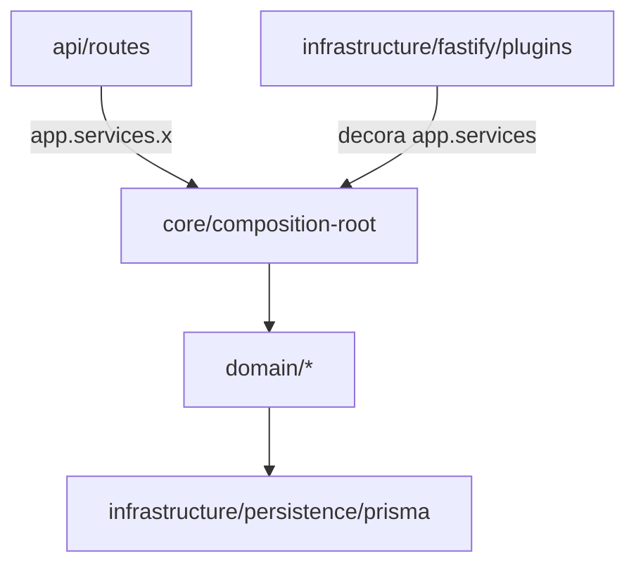

# Arquitetura

> Como o Fatia Rápida é estruturado em camadas DDD e por que.

## As 4 camadas

Inspirado no [Noto](https://github.com/bielsolosos) (mesmo autor), o projeto segue DDD-inspirado em MVC com 4 camadas:

| Camada | Pasta | Responsabilidade | Equivalente MVC |
|--------|-------|------------------|-----------------|
| **Apresentação** | `api/` | Transporte HTMX: routes, form inputs (Zod), view models | C + V (fronteira) |
| **Domínio** | `domain/` | Núcleo de negócio, por bounded context | M (modelo de domínio) |
| **Shared kernel** | `core/` | Cross-cutting: composition root, enums, exceptions, logger | Cross-cutting |
| **Infraestrutura** | `infrastructure/` | Detalhes técnicos: Prisma singleton, plugins Fastify | Technical |

## Fluxo de dependência



- **Routes** são finas: validam (Zod), chamam `app.services.x`, renderizam EJS.
- **Services** (classes) contêm a regra de negócio, recebem deps no construtor.
- **Domain** não sabe se fala com EJS ou JSON — transporte fica nos routes.
- **Composition root** é o único que sabe "quem depende de quem".

## Composition root

`core/composition/composition-root.ts` — o `buildServices(logger)` instancia o grafo inteiro:

```ts
export function buildServices(logger: Logger): Services {
  const processRunner = new ProcessRunner({ defaultTimeoutMs: 60_000 });
  const scriptStorage = new ScriptStorage();
  const scriptActionExecutor = new ScriptActionExecutor(processRunner);
  const actionFactory = new ActionExecutorFactory({ ... });
  const notificationService = new NotificationService([new DiscordChannel()], logger);
  const execucao = new ExecucaoService(prisma, logger, actionFactory, scriptActionExecutor, notificationService);
  const tarefa = new TarefaService(prisma);
  // ...
  return { tarefa, script, execucao, dashboard, scheduler };
}
```

O `servicesPlugin` (em `infrastructure/fastify/`) chama `buildServices` e decora `app.services`. A partir daí, qualquer route acessa `app.services.tarefa.create(input)` — type-safe via `declare module "fastify"`.

**Adicionar serviço novo = 4 passos:** criar a classe em `domain/<ctx>/service/` → criar o route em `api/routes/` → registrar no `Services` + `buildServices` → registrar o route no `app.ts`.

## Bounded contexts

`domain/` é dividido por contexto (cada um com `model/`, `service/`, e sub-pastas conforme a complexidade):

- **`tarefas/`** — `service/TarefaService` + `scheduling/` (SchedulerManager, cron helpers).
- **`scripts/`** — `service/ScriptService` + `storage/ScriptStorage` (cache self-healing).
- **`execucoes/`** — `service/ExecucaoService` (orquestrador) + `action/` (Strategy) + `runner/` (ProcessRunner) + `notification/` (Strategy) + `model/` (ExecucaoSaida).
- **`dashboard/`** — `service/DashboardService` (estatísticas agregadas).

Sub-contextos surgem quando há padrão de projeto (ex: `execucoes/action/` agrupa o Strategy + Factory).

## Por que DDD num app single-user?

Dogma DDD completo (repository port+impl, Specification, agregados ricos) seria ceremony aqui. O que **importa**:
- **Transporte isolado nos routes** — amanhã SPA só muda os routes, o domínio fica.
- **Services com estado (deps no construtor)** — logger/factory/notifier injetados, não passados em toda chamada.
- **Composition root visível** — o grafo de deps num arquivo, sem container mágico.
- **Padrões de projeto no núcleo de execução** — Strategy/Factory onde o if/else era custoso.

→ Decisões detalhadas nos [ADRs](adr/), especialmente [0001](adr/0001-ddd-layering.md), [0002](adr/0002-composition-root-over-spring-di.md), [0003](adr/0003-no-repository-pattern.md).
