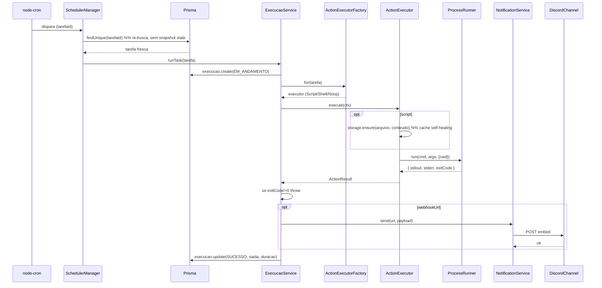
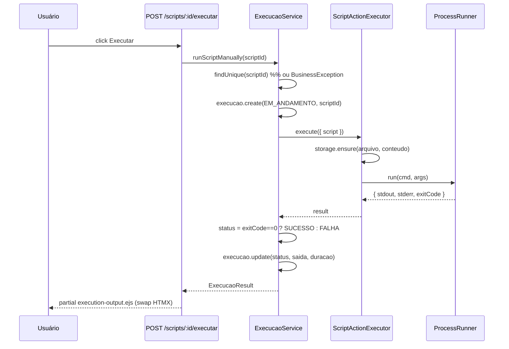

# Fluxo de Execução

> Como uma tarefa roda — do gatilho do cron ao registro persistido.

Dois caminhos entram no mesmo orquestrador (`ExecucaoService`): o **agendado** (cron dispara) e o **manual** (botão Executar num script).

## Fluxo agendado



Passo a passo:

1. **`node-cron`** dispara no horário agendado → chama `SchedulerManager.runOne(tarefaId)`.
2. **`SchedulerManager`** re-busca a tarefa no banco (`findUnique(tarefaId)`) — a closure só captura o `tarefaId` (string), nunca o snapshot da tarefa. Edição sem reschedule não roda versão obsoleta.
3. **`ExecucaoService.runTask`** cria o registro `Execucao(EM_ANDAMENTO)`.
4. **`ActionExecutorFactory.for(tarefa)`** seleciona o executor:
   - `scriptId` → `ScriptActionExecutor`
   - `comandoOuPayload` → `ShellActionExecutor`
   - senão → `NoopActionExecutor`
5. **`executor.execute(ctx)`** roda a ação:
   - **Script:** `ScriptStorage.ensure(arquivo, conteudo)` re-cria o arquivo do banco se faltar (cache self-healing) → `ProcessRunner.run(cmd, args)`.
   - **Shell:** `execAsync(comando)` via shell da plataforma; captura stdout/stderr mesmo no erro (antes se perdia).
   - **Noop:** retorna vazio.
6. Se `exitCode !== 0` (e não-NOOP) → throw (vira FALHA).
7. Se `tarefa.webhookUrl` → `NotificationService.send()` itera canais (`DiscordChannel`); falha de canal **não derruba** a execução (logado, segue).
8. **Persiste** `Execucao(SUCESSO, saida, duracao)` onde `saida` é `ExecucaoSaida` (union tipado). Em erro: `Execucao(FALHA, saida: {type:"ERROR", error, stdout, stderr})`.

## Fluxo manual (executar script pelo botão)



O manual e o agendado **compartilham o `ScriptActionExecutor`** — mesma infraestrutura (cmd/args por plataforma, `ensure`, `ProcessRunner`). Unificação que antes era duplicada (`executeScriptManually` vs `executeTask`).

## O `ensure` — cache self-healing

O `scripts/user/` é um **cache** do `Script.conteudo` (banco). Se o arquivo falta (container reiniciou, volume não montado, alguém apagou):

```ts
async ensure(arquivo: string, conteudo: string): Promise<void> {
  const filePath = path.join(config.scriptsDir, arquivo);
  try { await fs.access(filePath); }     // existe? skip
  catch { await this.write(arquivo, conteudo); }  // re-cria do banco
}
```

Chamado antes de todo spawn. O banco é a source of truth; o disco é reconstrutível. → [ADR-0007](adr/0007-ensure-cache-over-temp-file.md).

## Estado da execução

`ExecucaoStatus` enum (const tipado): `EM_ANDAMENTO` → `SUCESSO` | `FALHA`. O `saida` JSON segue o union `ExecucaoSaida` (ver [Data model](DATA-MODEL.md)).
