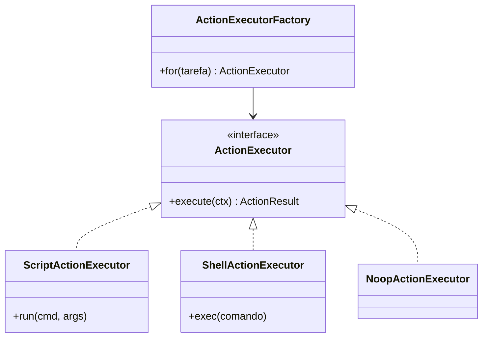
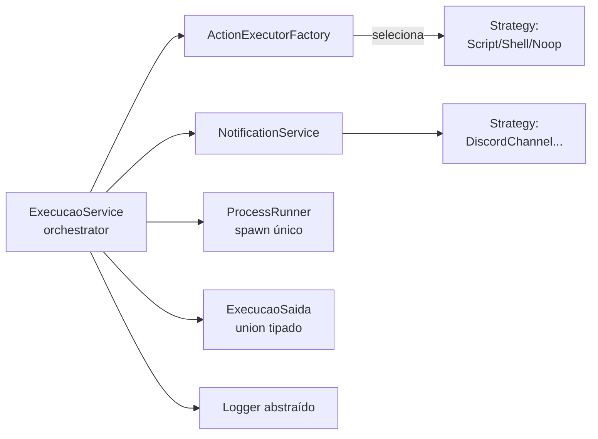

# Padrões de Projeto

> Os padrões aplicados no núcleo de execução e por que cada um entrou.

Cada padrão segue o formato: **Problema → Padrão → Sketch → Por quê**.

---

## Strategy — `ActionExecutor`

**Problema.** A tarefa podia rodar (a) um script vinculado, (b) um comando shell, ou (c) nada. Um `if/else` de 3 ramos no `executeTask` misturava DB + spawn + formatação Discord num só lugar.

**Padrão.** Interface `ActionExecutor` com 3 implementações; um `ActionExecutorFactory` seleciona a certa.



```ts
export interface ActionExecutor {
  execute(ctx: ActionContext): Promise<ActionResult>;
}
// 3 impls: ScriptActionExecutor, ShellActionExecutor, NoopActionExecutor
```

**Por quê.** Adicionar um 4º tipo de ação = 1 classe nova + 1 linha no factory. O orquestrador (`ExecucaoService`) não toca. Cada executor isola a sua complexidade (script cuida de cmd/args por plataforma; shell cuida do `exec` + captura de stdout no erro).

---

## Factory — `ActionExecutorFactory`

**Problema.** Selecionar o executor certo por `tarefa.scriptId` / `tarefa.comandoOuPayload` sem espalhar if/else.

**Padrão.** `ActionExecutorFactory.for(tarefa)` retorna o executor apropriado.

```ts
for(tarefa: Tarefa): ActionExecutor {
  if (tarefa.scriptId) return this.executors[ActionTipo.SCRIPT];
  if (tarefa.comandoOuPayload) return this.executors[ActionTipo.SHELL];
  return this.executors[ActionTipo.NOOP];
}
```

**Por quê.** A seleção fica num lugar; o caller (`ExecucaoService`) só pede `factory.for(tarefa)` e executa. Espelha o `ExportPageFactory` do Noto.

---

## Strategy/Observer — `NotificationChannel`

**Problema.** Discord era hardcoded no fluxo de execução; adicionar Slack/email exigiria mexer no orquestrador.

**Padrão.** Interface `NotificationChannel` com `DiscordChannel` (impl); `NotificationService` itera os canais.

```ts
export interface NotificationChannel {
  send(url: string, payload: NotificationPayload): Promise<void>;
}
// DiscordChannel absorveu o antigo webhook.service.ts
```

**Por quê.** Canal novo = 1 classe + 1 linha no array do `NotificationService`. E o `NotificationService` faz `try/catch` por canal — notificação falhando **não derruba** a execução (a tarefa rodou; só o aviso falhou).

---

## Template method (implícito) — `ExecucaoService`

**Problema.** O pipeline "criar registro EM_ANDAMENTO → rodar → notificar → persistir SUCESSO/FALHA" era um god-function de 140 linhas.

**Padrão.** `ExecucaoService.runTask` é o orquestrador fino (~30 linhas): cada etapa delega — `ActionExecutorFactory` pra ação, `NotificationService` pra aviso, `ExecucaoSaida` pro shape do resultado.

```ts
async runTask(tarefa) {
  const execucao = await this.prisma.execucao.create({ data: { status: EM_ANDAMENTO } });
  try {
    const result = await this.actionFactory.for(tarefa).execute(ctx);
    if (result.exitCode !== 0 && result.tipo !== NOOP) throw new Error(...);
    if (tarefa.webhookUrl) await this.notification.send(tarefa.webhookUrl, {...});
    await this.prisma.execucao.update({ data: { status: SUCESSO, saida, duracao } });
  } catch (err) {
    await this.prisma.execucao.update({ data: { status: FALHA, saida: {type:"ERROR",...} } });
  }
}
```

**Por quê.** O orquestrador só coordena; a lógica de cada etapa vive no seu colaborador (executor, notifier). Linha de execução legível e testável.

---

## Singleton — Prisma

**Problema.** `PrismaClient` é caro de instanciar e representa a conexão com o banco.

**Padrão.** Singleton em `infrastructure/persistence/prisma.ts` — uma instância, consumida pelos services.

```ts
export const prisma = new PrismaClient({ log: config.logLevel === "debug" ? [{ emit: "event", level: "query" }] : [] });
```

**Por quê.** Prisma já é tipado e faz o papel de repository. Não vale o ceremony de port+impl por agregado num app single-user SQLite. O composition root injeta o singleton nos services.

---

## Discriminated union — `ExecucaoSaida`

**Problema.** O campo `saida` (JSON no banco) tinha shapes ad-hoc (`{ type, stdout, stderr, comando? }` aqui, `{ type, scriptNome, exitCode }` ali) — sem tipo compartilhado, casts `as any` no route.

**Padrão.** Discriminated union por `type`:

```ts
export type ExecucaoSaida =
  | { type: "SCRIPT"; stdout: string; stderr: string; scriptNome: string; exitCode: number }
  | { type: "SHELL"; stdout: string; stderr: string; comando: string }
  | { type: "NOOP" }
  | { type: "ERROR"; error: string; stdout: string; stderr: string };
```

**Por quê.** TS estreita o tipo por `saida.type`; o modal de detalhes (EJS) lê `error`/`stdout`/`stderr` que existem em cada variante relevante. Sem `as any`.

---

## Logger abstraído

**Problema.** Services usavam `console.log("[Scheduler]...")` enquanto o resto usava `app.log` — e services não têm acesso ao `app` (são "puros").

**Padrão.** Interface `Logger` em `core/logger/`; `FastifyLogger` (wrap de `app.log`) injetado no composition root.

**Por quê.** Services recebem `Logger` no construtor — logam sem acoplar ao Fastify. O `app.log` (Pino) continua o motor real. → mata os `no-console` warnings.

---

## Mapa dos padrões


