# Fluxo de Requisição

> O ciclo de uma requisição HTTP no Fastify — do plugin à view.

## Ciclo de vida

```mermaid
flowchart LR
    REQ[HTTP Request] --> HEL[fastify-helmet\nCSP]
    HEL --> FB[fastify-formbody\nparse form]
    FB --> CK[fastify-cookie\nler cookies]
    CK --> ST[fastify-static\n/public]
    ST --> VW[fastify-view\nEJS engine]
    VW --> P1[prisma-plugin\nconnect]
    P1 --> P2[auth-plugin\nonRequest: carrega sessão]
    P2 --> P3[services-plugin\ndecora app.services]
    P3 --> ROUTE[route handler]
    ROUTE -->|preHandler| RA[requireAuth\n401 se não logado]
    RA --> VAL[Zod validate\napi/models/*/form]
    VAL --> SVC[app.services.x.method]
    SVC --> REPLY[reply.view\\npages/*.ejs]
    REPLY --> RENDER[EJS render]
    RENDER --> RESP[HTTP Response]
```



## Ordem de registro (em `app.ts`)

```ts
await app.register(prismaPlugin);     // app.prisma
await app.register(authPlugin);       // app.login, app.logout, app.requireAuth + onRequest session load
await app.register(servicesPlugin);   // app.services (composition root)
await app.register(authRoute);        // /login, /logout
await app.register(dashboardRoute);   // /
await app.register(tarefaRoute, { prefix: "/tarefas" });
await app.register(execucaoRoute, { prefix: "/execucoes" });
await app.register(scriptRoute, { prefix: "/scripts" });
await app.register(aboutRoute);       // /about
if (config.enableScheduler) await app.register(schedulerPlugin);  // app.scheduler, loadAll
```

**Por que essa ordem:** `servicesPlugin` precisa do `app.log` (Fastify logger) pra instanciar o `FastifyLogger` → vem depois de o app existir. Routes usam `app.services` → depois do `servicesPlugin`. Scheduler usa `app.services.execucao` → por último.

## O pattern HTMX (sem framework JS)

- **Página cheia** (`reply.view("pages/x.ejs", data)`) — navegação direta.
- **Partial HTMX** (`reply.view("partials/y.ejs", data)`) — swaps em resposta a `hx-*` attributes.
- **Sem handlers inline** — o CSP bloqueia `onclick`/`onchange`. Event delegation no `footer.ejs` (CSS class + `addEventListener`).

Exemplo: o botão "Executar" no `script-card.ejs`:
```html
<button hx-post="/scripts/{{script.id}}/executar" hx-target="#output-{{script.id}}" hx-swap="innerHTML">Executar</button>
```
O route responde com `partials/execution-output.ejs` (só o bloco de output), não a página inteira.

## `app.services` — acesso type-safe

Os plugins decoram o `FastifyInstance` via `declare module "fastify"`:

```ts
declare module "fastify" {
  interface FastifyInstance {
    prisma: PrismaClient;
    services: Services;
    scheduler: SchedulerManager;
    login: (...) => Promise<boolean>;
    // ...
  }
}
```

A partir daí, qualquer route acessa `app.services.tarefa.create(input)` — autocompleta, tipos checados. Se o composition root esquecer de instanciar um serviço listado no `Services`, o TS reclama na compilação.

## Tratamento de erro

- **`BusinessException`** (lançada pelo domínio) → `globalErrorHandler` → HTTP 400 + toast HTMX ou `pages/error.ejs`.
- **`ZodError`** → 400 + primeira mensagem.
- **`FastifyError` com `statusCode`** → usa o status.
- **Erro genérico** → 500 + log via `request.log`.

Routes não fazem `try/catch` de regra de negócio — o handler global pega. → [Security](SECURITY.md) pra auth/CSP, [Patterns](PATTERNS.md) pra BusinessException.
